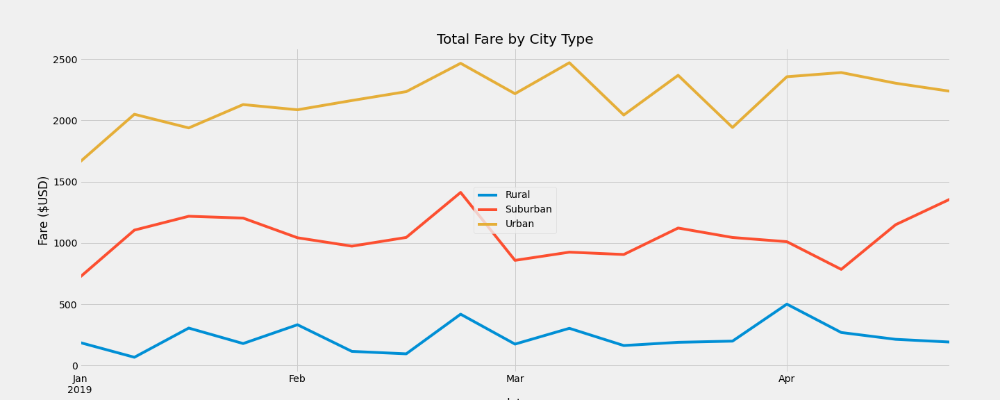

# PyBer Analysis

## Overview
In this analysis, we took the two .csv files for city_data and ride_data and merged them so that we could better handle the data. We then calculated parameters such as the total rides, total drivers, total fares, average fare per ride and driver involved by city type, and created a summary DataFrame so that we could see how these paramters compare based on city type. Then, we created a pivot DataFrame that showed the total fares by city type and date, and plotted our results for each city into a line graph using the object-oriented approach. With this analysis, we can now compare how the urban, suburban, and rural cities fares varied by week.

## Results
### Pyber Summary

### Total Fare by City Type

When looking at the Pyber Summary above, we can see that the rural cities have the lowest number of total rides and total drivers, which results in a lower amount of total fares. Because of this, it makes sense that the average fare per ride and average fare per driver is higher when compared to that of the other two city types. The urban cities, on the other hand, have the highest total rides and total drivers, resulting in higher total fares, and lower average fare per ride as well as lower average fare per driver, since we are dividing by a higher number of rides and a higher number of drivers. In addition to this, the average fare per ride in suburban cities is $6.44 more than in urban cities, and the average fare per driver in suburban cities is $22.93 higher than in urban cities. The line graph also shows very clearly that the city type bringing in the highest total fares per week is the urban city type, and the lowest is the rural city type.

## Summary
Based on the results shown, some business recommendations for the CEO would be that rural cities are in need of more drivers so that total fares from rural cities can go up, so rural cities should be focused on closely to increase number of drivers. Additionally, the gap between the number of drivers in urban cities is so large when compared to the other two city types, that perhaps the number of urban city drivers can be distributed between the three city types to help suburban and rural city fares increase. If that recommendation is difficult to achieve since by default, urban cities have a larger population size and therefore higher need for travel, another third recommendation could be to increase the cost per ride in rural cities so that total fare amounts can go up if it is not possible to get additional drivers in rural cities. Currently, average fare per ride and average fare per driver in rural cities is the highest, so getting additional drivers or additional rides in rural cities will help the average go down a bit.
